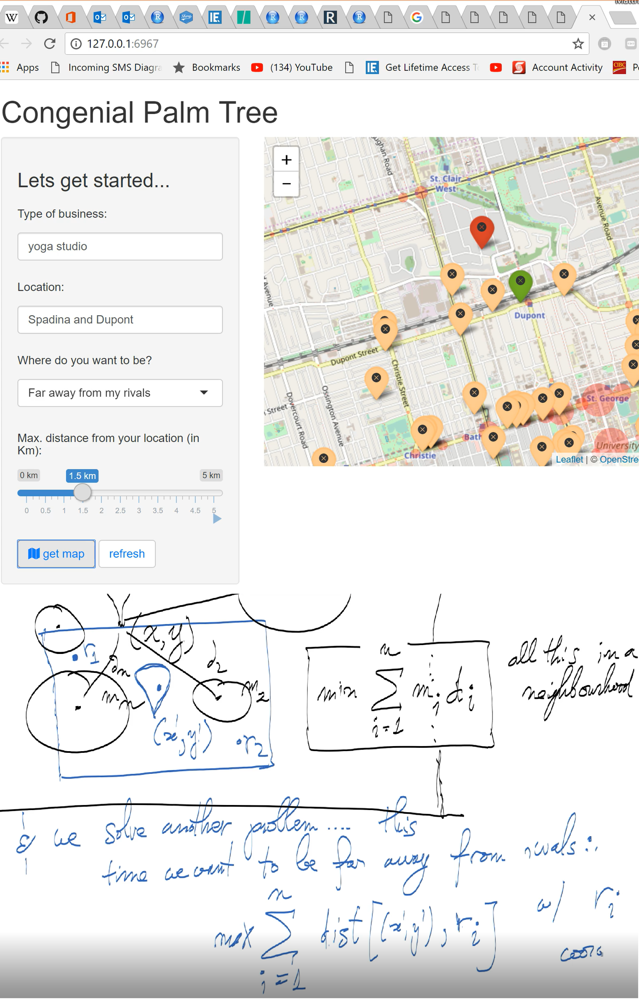

# congenial-palm-tree

LP optimization with an in-house `sub-neighhbourhood` approach in R. 

Built in a few days with @EldrickWega. It would be nice to clean up or add something like a Zillow API integration someday to get the freshest possible real estate data.

  

